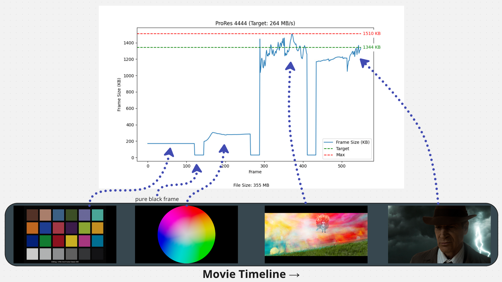
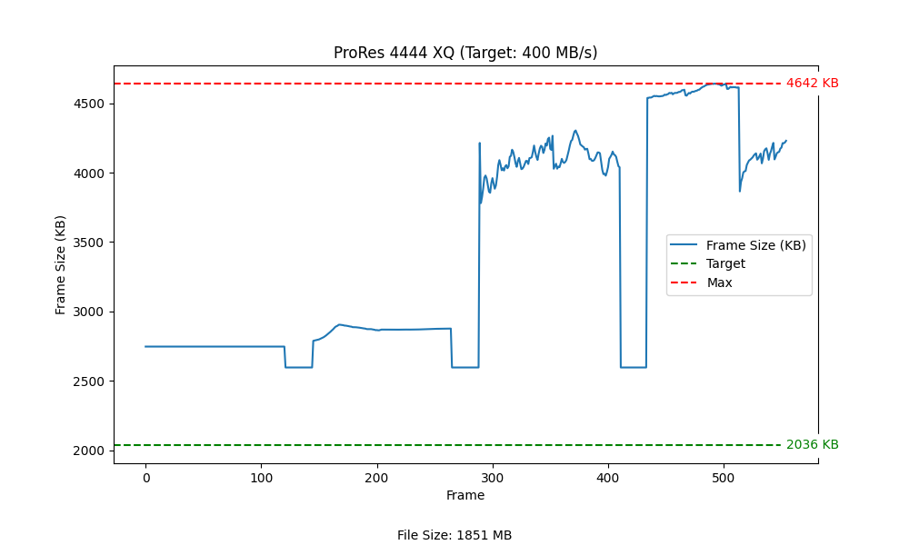
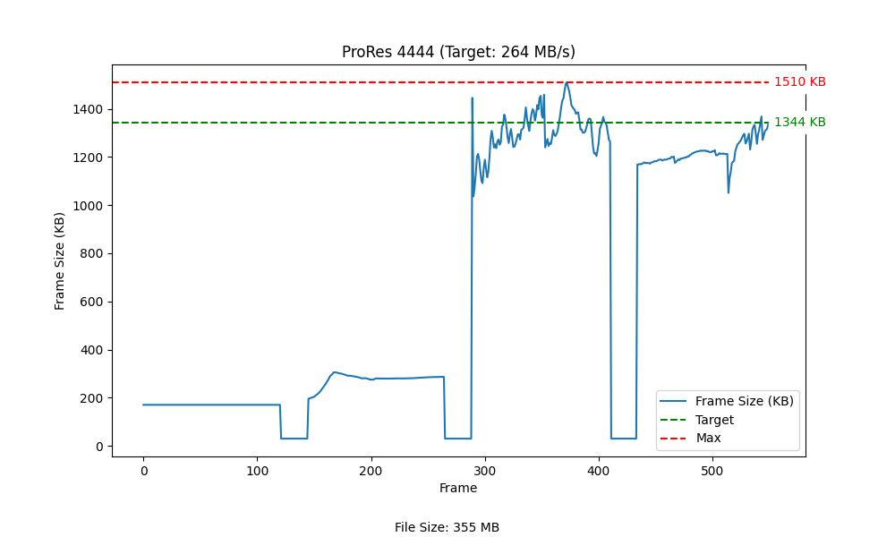
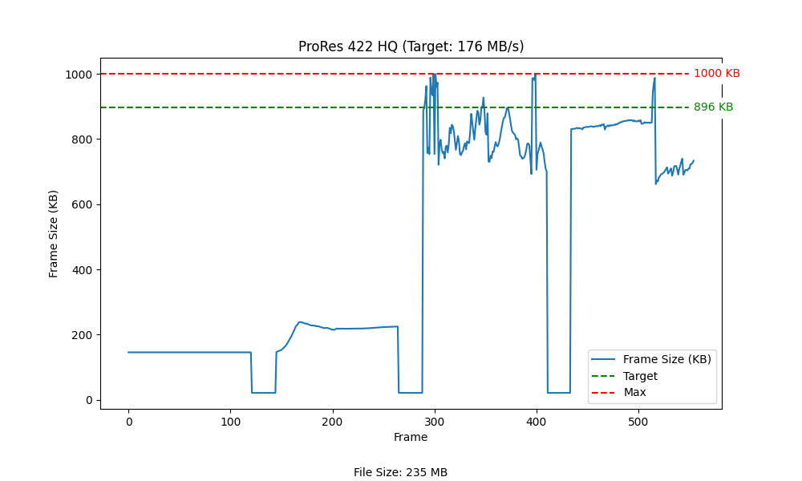
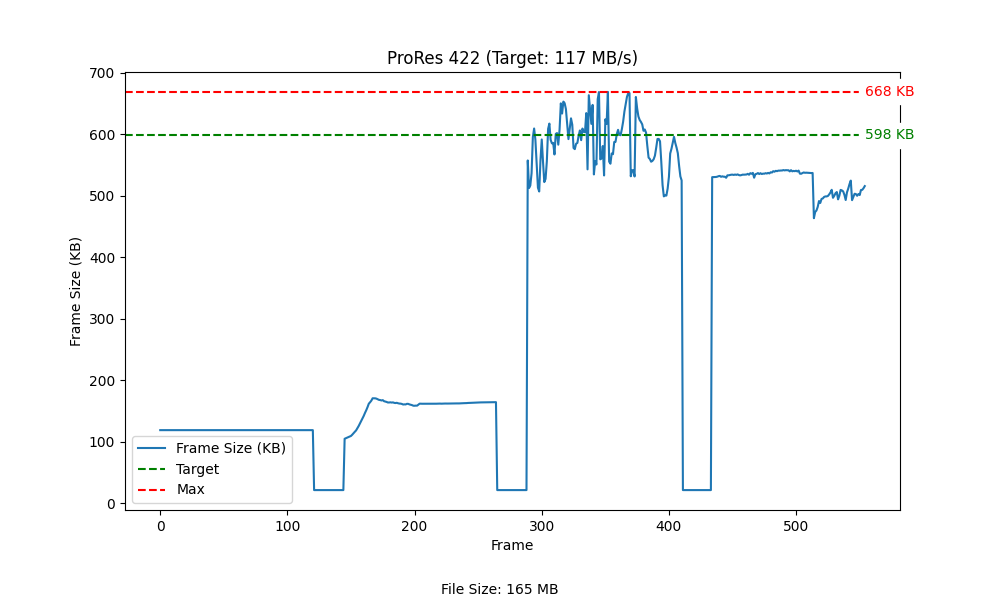
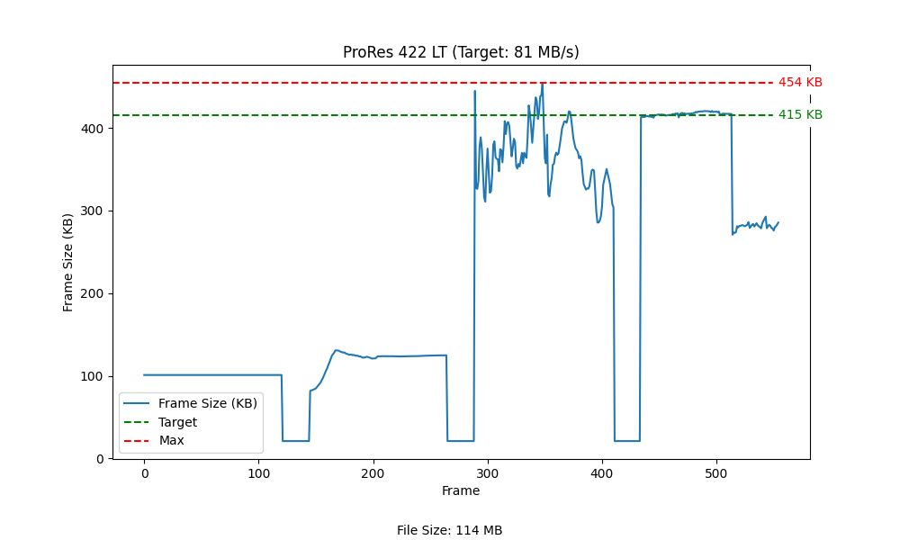
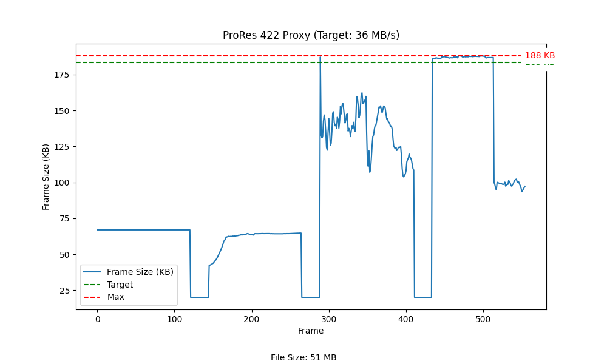
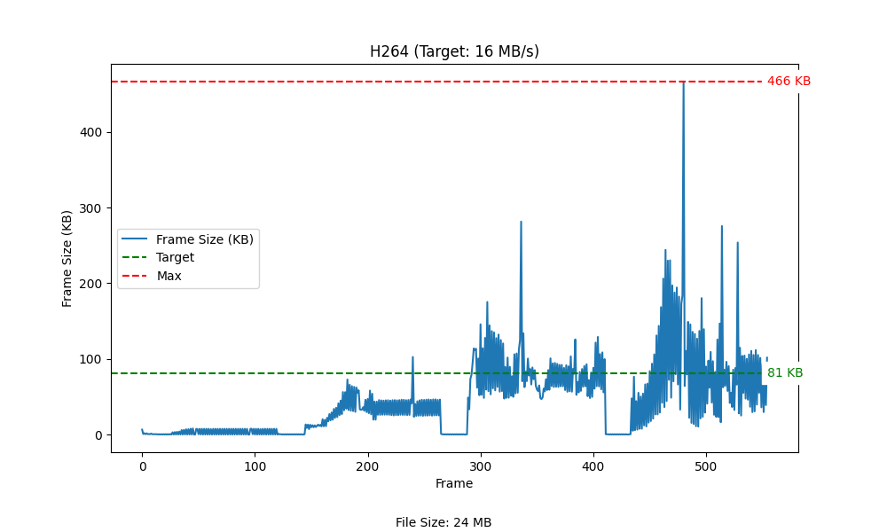

# VBR Visualizer
## Overview
The purpose of this project is to analyze the variable bit rate (VBR) encoding of different video codecs by examining the frame sizes throughout a video sequence. The project generates charts to visually represent the frame sizes and compare them against the target and maximum bitrates defined by the codecs.


The project takes a HDR Rec. 2020 video file as input and generates a chart displaying the size of each frame. The charts show the frame sizes in kilobytes (KB) for each frame in the video sequence. The target and maximum bitrates are also displayed on the charts for comparison.


## Test Footage
I put the test footage together, it can be found here as a ProRes 4444 XQ file. 
[](https://www.youtube.com/watch?v=yXRbtNwe0bU)

## Target Bitrates
The target bitrates for different codecs are defined in codec_target_bitrates.py. The bitrate provided is from developer documentation and is accurate for 29.97 fps. However, my project uses 24fps video, so I convert the target bitrates at runtime for 24fps.
```python
CODEC_TARGET_BITRATES = {
    'ProRes 4444 XQ': {'bitrate': 500, 'filename': 'prores4444xq'},
    'ProRes 4444': {'bitrate': 330, 'filename': 'prores4444'},
    'ProRes 422 HQ': {'bitrate': 220, 'filename': 'prores422hq'},
    'ProRes 422': {'bitrate': 147, 'filename': 'prores422'},
    'ProRes 422 LT': {'bitrate': 102, 'filename': 'prores422lt'},
    'ProRes 422 Proxy': {'bitrate': 45, 'filename': 'prores422proxy'},
    'DNxHR HQX': {'bitrate': 666, 'filename': 'dnxhr_hqx'},
    'DNxHR HQ': {'bitrate': 666, 'filename': 'dnxhr_hq'},
    'DNxHR SQ': {'bitrate': 441, 'filename': 'dnxhr_sq'},
    'DNxHR LB': {'bitrate': 137, 'filename': 'dnxhr_lb'},
    'H264': {'bitrate': 16, 'filename': 'h264'}
}
```

# Findings
Below are the charts generated from analyzing the test footage. Each chart shows the frame sizes in KB, along with the target and maximum frame sizes for comparison.

### ProRes 4444 XQ


### ProRes 4444


### ProRes 422 HQ


### ProRes 422


### ProRes 422 LT


### ProRes 422 Proxy


### H264


# Compression Quality
The following charts compare the compression quality of each of the codecs by taking the compressed result and merging them into the original result with a "difference" equation. And then that result is multiplied by 50, so that it's easier to see the visual differences.

### Reference Frame


### ProRes 4444 XQ


### ProRes 4444


### ProRes 422 HQ


### ProRes 422


### ProRes 422 LT


### ProRes 422 Proxy

